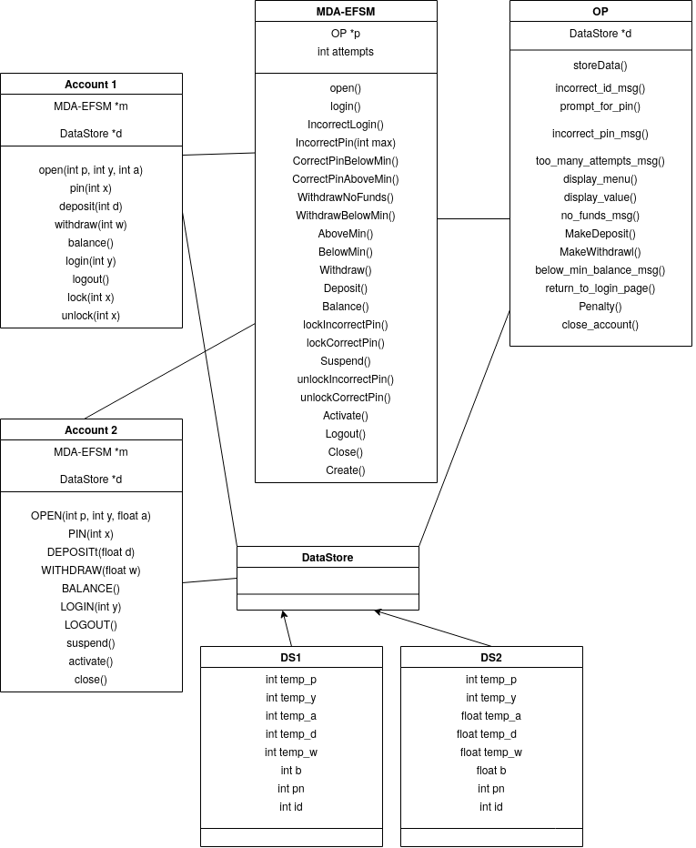
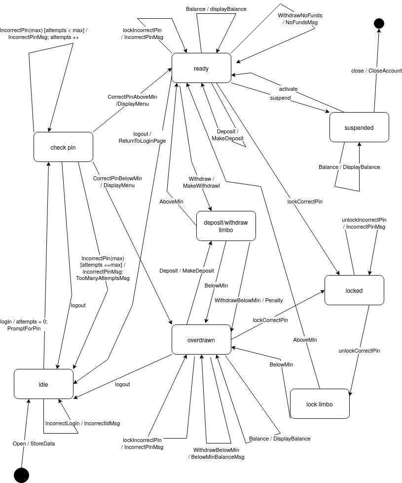
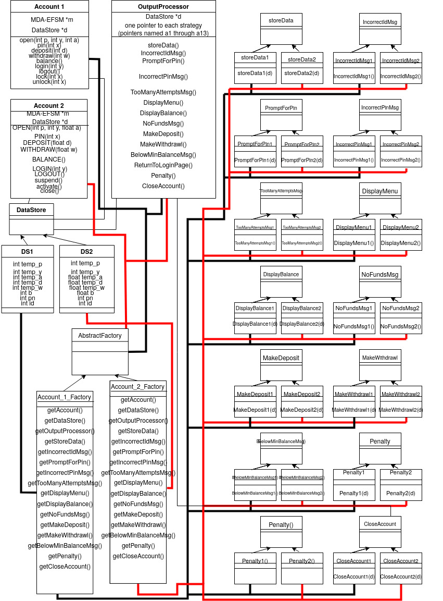
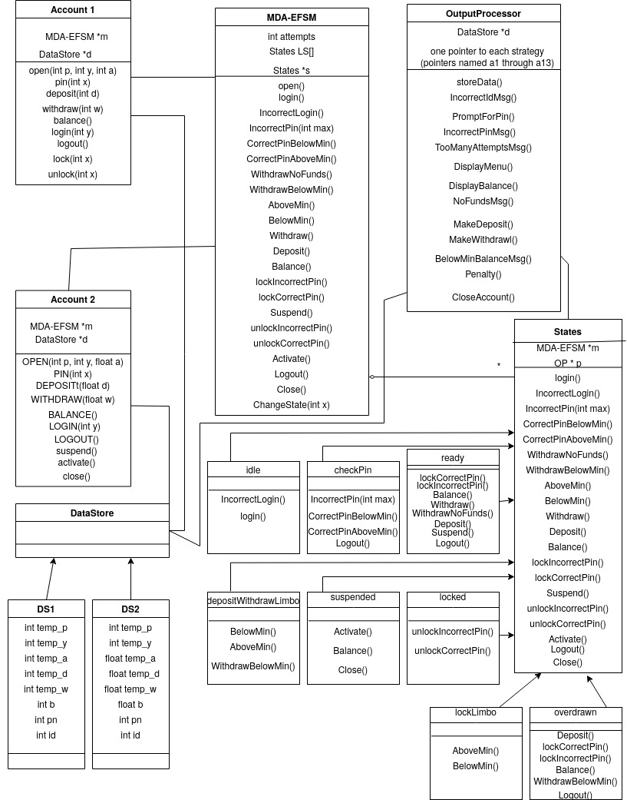
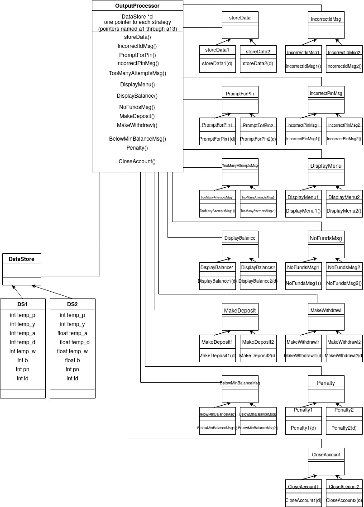

# Project Description
This Java program utilizes Model-Driven Architecture, Extended Finite State Machine (MDA-EFSM) and incorporates the following object oriented design patterns: state pattern, strategy pattern, and abstract factory pattern. It can handle two distinct account types which have different data types and which support different opperations and policies.

Program architecture and the software model can be seen in the following diagrams.

## Class Diagram

## MDA EFSM

## Abstract Factory

## State Pattern

## Strategy Pattern

